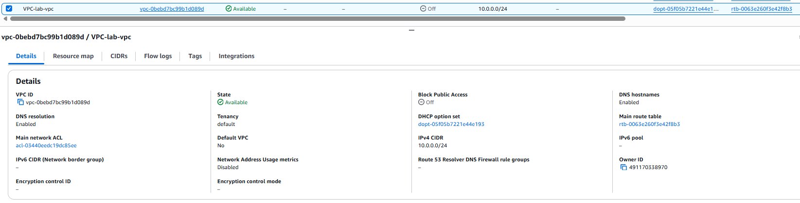
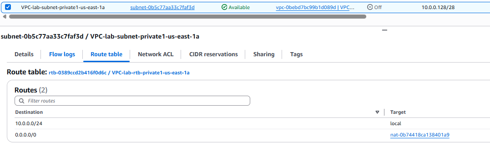
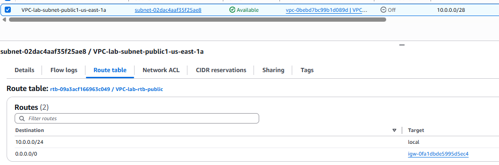
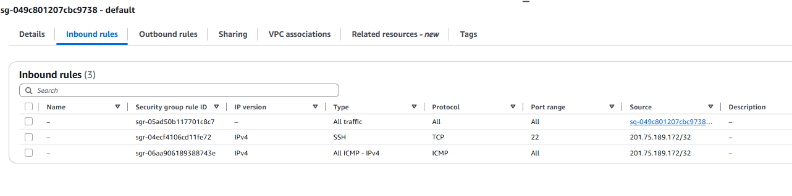
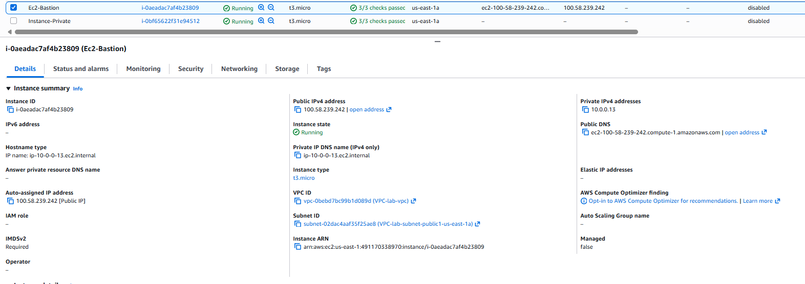
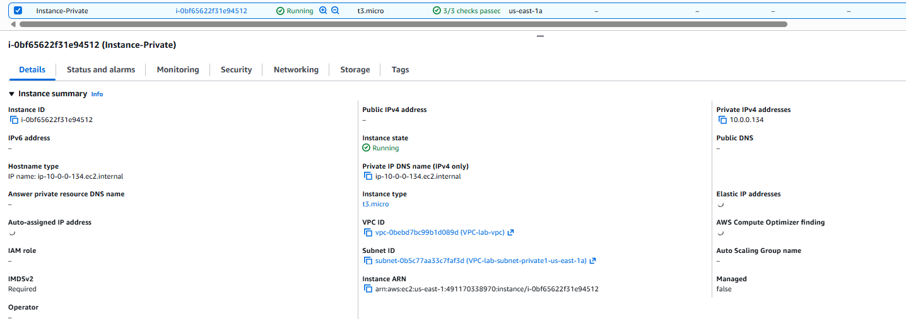
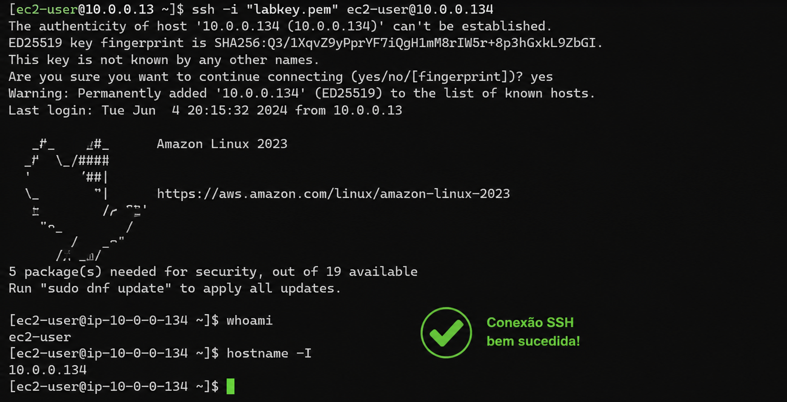
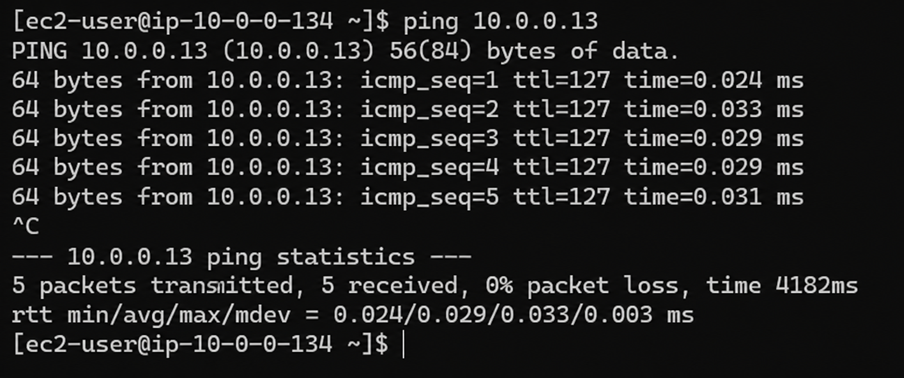
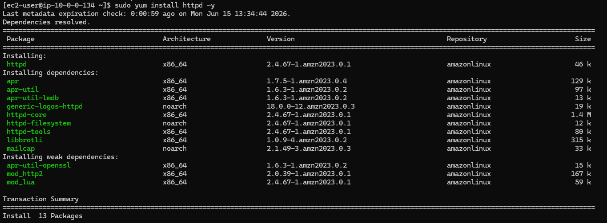
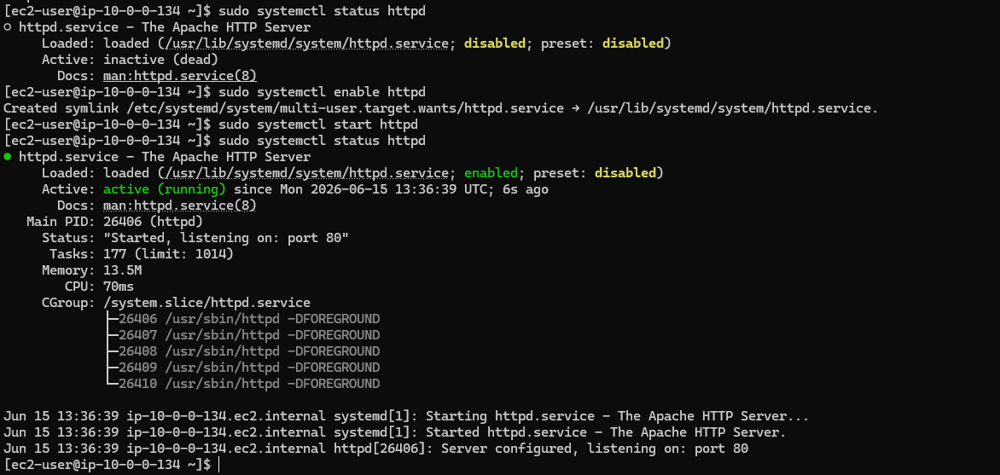

# AWS Bastion Host and NAT Gateway Lab

## Objetivo

Criar uma arquitetura segura na AWS utilizando uma instância Bastion Host em uma sub-rede pública para acesso administrativo a uma instância EC2 em uma sub-rede privada, permitindo que a instância privada acesse a Internet através de um NAT Gateway sem possuir endereço IP público.

## Arquitetura

### VPC 

* Nome: VPC-lab-vpc
* CIDR: 10.0.0.0/24

### Sub-redes

* Public Subnet

* Private Subnet

### Componentes

* Internet Gateway
* NAT Gateway
* Bastion Host
* EC2 Private
* Route Tables
* Security Groups

## Security Groups

### SecurityGroup

Inbound Rules:

* SSH (22) → Meu IP
* ICMP → Meu IP

Outbound Rules:

* All Traffic → 0.0.0.0/0

## Instâncias

### Bastion Host

* Subnet: Public
* IP Público: Sim
* IP Privado: 10.0.0.13

### EC2 Private

* Subnet: Private
* IP Público: Não
* IP Privado: 10.0.0.134

## Testes Realizados

### Acesso SSH

Acesso realizado com sucesso à instância Bastion Host utilizando SSH.

Posteriormente foi realizado acesso à instância privada através da Bastion Host.

### Conectividade com a Internet

Teste executado:

ping 8.8.8.8

Resultado:

Conectividade validada com sucesso através do NAT Gateway.

### Instalação de Pacotes

Comandos executados:

sudo apt update

sudo apt install apache2 -y

Resultado:

Instalação realizada com sucesso em uma instância privada sem IP público.

## Conceitos Praticados

* Amazon VPC
* Public Subnet
* Private Subnet
* Internet Gateway
* NAT Gateway
* Route Tables
* Security Groups
* Bastion Host
* SSH
* Acesso seguro a instâncias privadas
* Troubleshooting de conectividade
* Acesso à Internet por instâncias privadas
